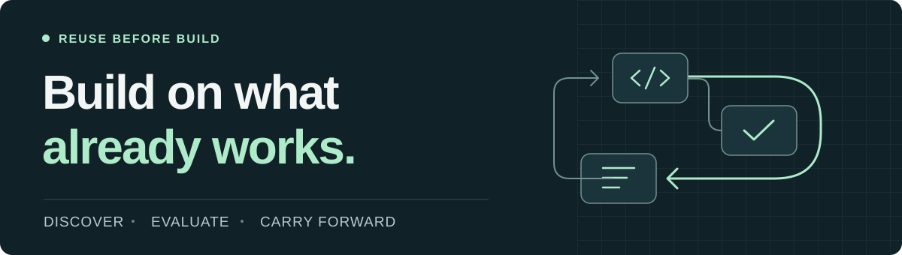

<h1 align="center">reuse-before-build</h1>

<p align="center">
  <a href="LICENSE"></a>
  <a href="https://agentskills.io/specification"></a>
  <a href="https://github.com/Ai-Eastern/reuse-before-build/commits/main/"></a>
</p>

<p align="center"><strong>发现已有实现，复用代码与测试，带着证据接续任务。</strong></p>
<p align="center">一个自足的 <code>SKILL.md</code> · 无需服务 · 无运行时依赖</p>

[English](README.md) · [何时使用](#何时使用) · [快速开始](#快速开始) · [实际结果](#实际结果) · [工具兼容](docs/compatibility.md) · [MIT 许可](LICENSE)

让编码 Agent **在架构设计或新项目技术选型前，先发现已有实现**，再判断哪些可以 **Take · 直接复用、Borrow · 借鉴适配、Build · 自行补齐**。项目现有成果留下实质缺口时，它会检索 GitHub 和官方仓库，检查真实代码、兼容性、集成成本与许可范围，再提出方案。

同一套流程也用于写代码前检查已有实现、补测试前检查现有覆盖、接续任务前核对历史证据。它引导 Agent 形成有依据的最小设计或改动，使用项目与宿主已经具备的工具开展工作。

## 用起来是什么效果

**架构发现——流程示意，并非已执行的评估：**

```text
用户要求：为新服务设计持久化 webhook 投递。
发现候选：在 GitHub 和官方仓库查找相关实现。
检查依据：阅读核心代码、失败语义、集成要求和许可。
形成决策：直接复用已核实的核心，借鉴适用模式，只补缺失部分。
设计交付：说明复用边界如何影响架构，以及还有哪些检查未完成。
```

[架构示例](examples/architecture-reuse-example.md)展示了做出这些判断所需的约束与证据。仅要求架构设计时，交付物仍是设计，不代表授权安装依赖或编写实现代码。

**测试复用——旧版本（2026-09-20）的实际观察：** 下面是小型重试服务模拟项目中的一次评估，Agent 显式加载了当时版本的 Skill：

```text
用户要求：补齐重试失败边界的测试。
Agent 找到：已有的重试函数和测试套件。
实际改动：在原测试文件增加 2 个用例，生产代码未变。
验证结果：4 个测试全部通过。
```

最终交付是在现有测试上的针对性补充。可以查看[实际差异](evals/results/2026-09-20/test-borrow.patch)和[测试复核日志](evals/results/2026-09-20/test-borrow.tap)。这项观察对应当时版本，具体日期和范围见下方实际结果。

## 何时使用

- **适用任务：** 新项目架构与技术选型、开发较大功能、选择依赖、补齐测试覆盖，或接续未完成的工程任务。小改动只做简短的本地检查。
- **如何调用：** 明确选择或提及 `reuse-before-build`，即可要求使用这套流程。支持自动选择 Skill 的宿主，也可能按任务与描述的匹配程度加载它；并非每次任务都保证自动调用，首次使用建议明确点名检查是否加载。详见[宿主加载说明](docs/compatibility.md#verify-discovery-and-behavior)。
- **如何接续：** 交接前让 Agent 保存工程记录，下一会话提供记录路径；Agent 再将记录与当前代码、测试证据核对。安装 Skill 本身不会保存全部对话，也无法找回从未记录的信息。

## 快速开始

在**需要使用 Skill 的项目**中打开终端，执行：

```bash
npx skills@1.7.0 add Ai-Eastern/reuse-before-build --skill reuse-before-build --agent codex --copy -y
```

可选安装器要求 **Node.js ≥22.20.0**，Skill 本身不需要。也可以手动将 `SKILL.md` 和 `LICENSE` 放到 Codex 项目的 `.agents/skills/reuse-before-build/`；详见[复制命令与其他工具目录](docs/compatibility.md#manual-installation)。

<details>
<summary>从本地工作副本安装</summary>

使用干净的工作副本或源码包。在另一个需要使用 Skill 的项目中，替换来源路径后执行：

```bash
npx skills@1.7.0 add "<absolute-path-to-clean-checkout>" --skill reuse-before-build --agent codex --copy -y
```

不要在 Skill 源仓库内执行 `add .`，详见[本地安装说明](docs/compatibility.md#optional-installer)。

</details>

在 Agent 中打开目标项目，明确选择或提及 `reuse-before-build`，然后给它一个真实任务：

```text
使用 reuse-before-build，给已有 HTTP 客户端增加重试支持。
先检查已有代码、测试和相关决策。
修改前说明：哪些成果可以复用、哪些结论需要验证，以及最小下一步。
```

如果当前任务是架构设计：

```text
使用 reuse-before-build，为新项目设计持久化 webhook 投递。
现有成果不足时，查找 GitHub 和官方仓库中的实现。
说明哪些可以直接复用、借鉴适配或自行补齐，以及它们如何影响架构。
本次只做设计，不安装依赖或编写实现代码。
```

结果应引用实际文件或来源，并解释选择。无法加载时参照[加载排查](docs/compatibility.md#troubleshooting)，也可以先用仓库中的[练习项目](evals/fixtures/retry-service/README.md)尝试。

## 工作方式

**先找已有成果 → 核对适用性与证据 → 选择最小范围 → 验证。**

按本地代码与测试、标准库或平台能力、已安装依赖的顺序检查，必要时再查外部候选。架构设计或新项目选型存在实质缺口时，在确定组件与边界前查找 GitHub 和官方仓库中的实现。深入检查最合适候选的代码与契约，README 声明或搜索摘要不能证明适用。

外部检索按事件范围触发：只有未解决的能力或兼容性缺口才会开启外部研究，已验证的本地适配即可停止。新增测试前先阅读现有运行器、真实断言、夹具和实际执行路径。单独出现错误、新阶段或新会话，不会触发新的候选调研。

找到候选后继续核查：选型前记录实际读取的版本或修订、兼容性字段、实现符号、测试或调用位置，以及适用许可证。缺证据的候选保留为待核验选项。“只做设计”可以暂缓安装和集成测试，但仍需完成这些核查才能确定组件。

证据充分即可停止。现有成果已满足需求时，无需联网检索；检索也必须遵守用户限制。外部发现依赖宿主已有的检索工具和网络访问能力，Skill 不提供这些工具或权限。小改动只做简短的本地检查。

| 决策 | 接下来做什么 |
| --- | --- |
| **Take · 直接复用** | 使用已满足需求的成果，并做相关验证。 |
| **Borrow · 借鉴适配** | 扩展已有实现、测试或模式，明确改动边界。 |
| **Build · 新建** | 检查合理复用选项后，只补齐缺失的行为。 |

所选路径缺少必要证据、且没有已验证替代方案时，报告 **Blocked**。具体下一步超出现有授权时，报告 **Needs human approval**。一个候选不适用，不会阻止另一条已有证据支持的路径。

### 让工程决策跨会话继续有效

交接前，保留目标、工作区状态、可复用成果、决策、验证和下一步。优先使用项目已有记录，也可采用[检查点模板](templates/reuse-checkpoint.md)，并把记录路径提供给接续会话。

恢复时，将记录与当前请求、工作区重新核对：保留仍适用的结论，只复查受变化影响的部分。交接摘要不会新增授权。接续依赖可读取的记录，不保证自动记忆或自动捕获宿主的上下文压缩事件。

## 实际结果

**GPT-6 Luna / high 复测——2026-09-26。** [最新核心回归](evals/results/2026-09-26/luna6-closure/REPORT.md)在 V9 上完成两个独立联网设计，以及十二个本地场景。本地场景均通过有边界的审查，覆盖测试复用、有效补测、历史结果核对和交接权限；变异测试确认新增用例能抓住目标缺陷。受宿主新 Agent 数量上限影响，这十二项在两个已有会话中接续执行。队列设计有源码依据并保留部署条件；数据分析仍在分组聚合证据不足时作出了选型。因此不宣称全项通过或稳定成功率。[此前正文核验结果](evals/results/2026-09-26/luna6-content/REPORT.md)和失败记录均保留。

**候选核验——2026-09-26，GPT-5.6 Luna / medium。** [新增 11 次实测](evals/results/2026-09-26/evidence-gate/REPORT.md)检查分步核验与具体证据记录。最终复测已读取固定版本的源码和许可证；离线场景能区分有许可的样例与缺少权利证据的候选。真实选型中仍有交叉验证缺项，因此记录为有改进、仍有边界，未宣称全部通过。

**搜索时机与测试复用——2026-09-21，GPT-5.6 Luna / medium。** [17 次实测](evals/results/2026-09-21/luna-search-timing/REPORT.md)包含对照与复测。补强规则后，模型能在已有测试充分覆盖时不改文件，并写出能捕获故意错误实现的断言；需求变化时，会先检查本地再搜索外部候选。两次架构试跑仍未完成候选源码与许可证核查。报告保留失败、版本哈希与评估边界；这是小样本探索，不是成功率承诺。

**架构发现——2026-09-21，历史架构修订。** 一个新上下文 Agent 显式加载该修订，为 Node.js/PostgreSQL 后台任务服务做选型，要求不增加 Redis。它初筛三个候选、深入检查两个，引用固定修订的源码提出组件边界和待执行的集成检查；未安装依赖、未运行运行时测试。可以查看[设计结果](evals/results/2026-09-21/architecture-result.md)、[来源](evals/results/2026-09-21/architecture-sources.json)和[复核记录](evals/results/2026-09-21/architecture-review.json)。这是一次有源码依据的设计建议，不代表部署已经验证。

另外两个新上下文 Agent 在小型重试服务模拟项目中，显式加载了 **旧版本（2026-09-20）** 后完成以下任务。这些记录仅对应当时的 Skill 哈希：

| 场景 | 实际观察 | 证据 |
| --- | --- | --- |
| **扩展已有测试** | 原测试文件新增 2 个用例，生产代码未变，**4/4 通过**。 | [差异](evals/results/2026-09-20/test-borrow.patch) · [复核日志](evals/results/2026-09-20/test-borrow.tap) |
| **源码变更后接续** | HEAD 未变，但识别出旧的通过结果已失效；报告 **1 通过、1 失败**，未修改工作区。 | [记录](evals/results/2026-09-20/dirty-resume.json) · [复核日志](evals/results/2026-09-20/dirty-resume.tap) |

第二个场景刻意引入了回归，识别失败就是预期行为。这是两次有界观察，没有对照实验，不代表普遍成功率或 token 节省比例。详见[评估方法、证据与覆盖边界](docs/validation.md)。

## 与你的 Agent 配合使用

已整理 **Codex、Claude Code、GitHub Copilot CLI、Cursor、Gemini CLI、OpenCode 和 Windsurf** 的安装路径。各工具的证据程度不同：文档支持格式、安装检查通过和实际行为验证，是不同的结论。

[兼容指南](docs/compatibility.md)逐项记录了目录与验证状态。Skill 使用 Agent 原本具备的文件、检索和测试工具。

## 示例与贡献

- **从具体任务开始：** [为架构发现已有实现](examples/architecture-reuse-example.md)、[复用代码](examples/take-example.md)、[适配代码](examples/borrow-example.md)、[补齐实现](examples/build-example.md)、[复用测试](examples/test-reuse-example.md)、[接续工作](examples/resume-example.md)。
- **了解决策边界：** [证据不足](examples/blocked-example.md)、[授权边界](examples/needs-approval-example.md)。这些是说明性示例，实际运行记录见上方。
- **帮助改进：** [提交可复现案例](https://github.com/Ai-Eastern/reuse-before-build/issues/new/choose)、验证一种工具，或[运行评估](evals/README.md)。附上修订、宿主与模型、任务、预期结果和脱敏证据。

<details>
<summary>范围与限制</summary>

这是指令工作流，效果取决于宿主和模型。它不增加工具、不提供运行时强制拦截，也不保证降低成本。外部检索需要 Agent 已有的网络能力；证据检查不能替代安全或法律审查。

接续只覆盖当前任务的工程状态，不索引无关对话、不提供全局记忆、不授予额外权限。示例、模板和评估资产均为可选；核心指令在 [SKILL.md](SKILL.md) 中。

</details>

[MIT](LICENSE) · 再分发时请保留版权和许可声明。
